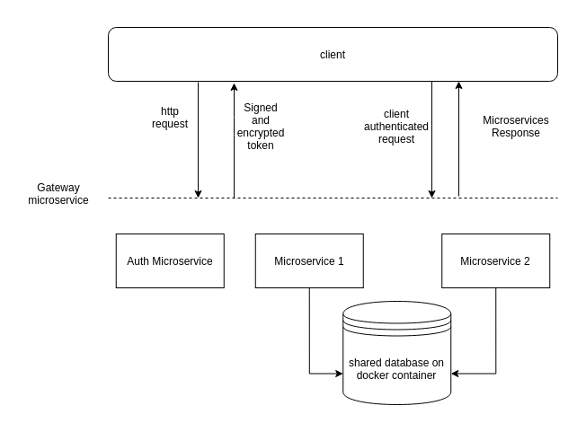

# microservices

This repo show a minimal example using spring boot how to create your own app with microservices architecture.

# Application architecture

This architecture work as follow:  
The clients request microservices through gateway (who redirect for appropriate microservice), before redirect to one of the microservices, the gateway request to auth microservice to generate valid tokens. This is the first step before request the microservices properly authenticated after retrieve tokens at response header. A authenticated request still must pass through a filter, who gets information about client, like "roles" and if this requested route allow this client role, if client credentials are valid, i.e., token is signed and valid, then the client is allowed to consume the rest services.


# Getting Started

This project show features which a minimal microservices architecture must have on my own opinion.

### Prerequisites

You will need a java version installed (11 or later) and a IDE to run locally. (STS or Eclipse EE). Also a rabbitmq server (either local or hosted)

### Installing

I'll give you a hand a tell how to install this project on you own machine.

First, clone the project to your local storage.

Then,

```
After unzip on a directory of your choice, open your favorite java IDE and import the project as maven project
```

Finally,

```
Run the application as spring boot
```

## Built With

- [Spring Boot](https://spring.io/projects/spring-boot) - The web framework used
- [Maven](https://maven.apache.org/) - Dependency Management

## License

This project is licensed under the MIT License

## Thanks

Thanks for [devdojobr](https://github.com/devdojobr) for share this amazing course for free.
